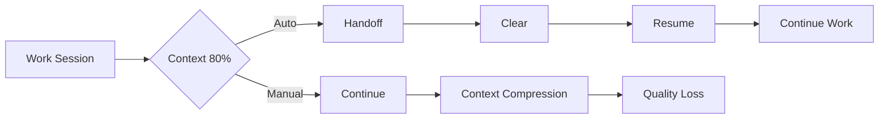

# Claude Config Design Philosophy

## Core Principles

### 1. Override Hierarchy
```
Project Level (.claude/) > Account Level (~/.claude/) > Built-in Claude Code
```

This three-tier hierarchy enables:
- **Flexibility**: Projects can customize for their specific needs
- **Consistency**: Account-level provides personal defaults
- **Compatibility**: Built-in commands remain as fallback

### 2. Progressive Enhancement
Rather than replacing existing functionality, we enhance and complement:
- New commands add capabilities without breaking existing workflows
- Agents provide intelligence layers on top of basic operations
- Hooks automate without forcing specific behaviors

### 3. Language-Aware Context Injection
Account-level agents automatically adapt to project context:
- Detect language/framework from project files
- Apply appropriate rules and patterns
- Maintain general best practices while adding specific optimizations

## Architecture Overview

```
profiles/
├── account/                    # Global user settings
│   ├── agents/                # Smart, context-aware agents
│   ├── commands/              # User workflow commands
│   ├── scripts/               # Automation scripts
│   │   └── hooks/            # Event-driven automation
│   └── settings/             # Configuration files
│
└── projects/                  # Language/framework specific
    ├── _base/                # Common template
    ├── python/               # Python-specific
    ├── javascript/           # JavaScript-specific
    └── [language]/          # Other languages
```

## Key Design Patterns

### Context-Aware Agents
Agents at the account level are designed to be smart by default:

```yaml
# Agent automatically detects and adapts
context_detection:
  python: ["requirements.txt", "pyproject.toml"]
  javascript: ["package.json", "yarn.lock"]
  rust: ["Cargo.toml"]

behavior_adaptation:
  python: "Use pytest, black, mypy conventions"
  javascript: "Use jest, eslint, prettier conventions"
  rust: "Use cargo test, clippy, rustfmt conventions"
```

### Command Enhancement Strategy
Commands follow a wrapper pattern:
- Preserve original functionality
- Add value through pre/post processing
- Maintain backward compatibility

Example:
```markdown
/commit (enhanced)
  ├── Analyzes changes (pre-process)
  ├── Generates conventional commit message
  ├── Invokes git commit (core function)
  └── Updates tracking (post-process)
```

### Hook-Driven Automation
Hooks provide opt-in automation without forcing workflows:

```bash
# Event-driven triggers
context_monitor.sh    # Monitors context usage
auto_handoff.sh      # Triggers handoff at threshold
post_tool_format.sh  # Formats code after edits
```

## Implementation Philosophy

### 1. Gradual Adoption
- Start with non-invasive additions (new commands)
- Add optional enhancements (agents)
- Introduce automation last (hooks)
- Each phase independently valuable

### 2. Safe Rollback
Every feature must be:
- Independently removable
- File-based (no database/registry changes)
- Non-destructive to existing workflows
- Documented for clean uninstall

### 3. Project-First Development
Features are designed with project override in mind:
- Account level provides sensible defaults
- Projects can override any component
- Override mechanism is consistent across all features

## Context Management Strategy

### The Handoff-Resume Paradigm
Central to our workflow optimization:



Key principles:
- Proactive context preservation
- Intelligent resume with appropriate agents
- Workflow continuity maintenance
- Minimal cognitive overhead

### Smart Delegation
Based on task complexity and state:

```python
def determine_delegation(task):
    if task.complexity > 7:
        return "plan-agent"  # Strategic planning
    elif task.state == "debugging" and task.confidence < 4:
        return "debugger"     # Systematic debugging
    elif task.type == "review":
        return "code-reviewer"  # Comprehensive review
    else:
        return "direct"       # Direct execution
```

## Quality Assurance Principles

### 1. Test-Driven Enhancement
- Every new feature includes test scenarios
- Override behavior must be verifiable
- Performance impact must be negligible

### 2. Documentation-First
- Design documents before implementation
- Clear override examples
- Migration guides for breaking changes

### 3. Community-Aligned
- Follow established Claude Code patterns
- Adopt community best practices
- Maintain compatibility with popular tools

## Security and Privacy

### Principles
- No telemetry or data collection
- All processing happens locally
- Configuration is human-readable
- No external dependencies for core features

### Safe Automation
Hooks and scripts follow security best practices:
- Explicit user consent for automation
- Clear visibility of actions taken
- Audit logging for automated changes
- Sandboxed execution where possible

## Future-Proofing

### Extensibility Points
The architecture provides clear extension mechanisms:

1. **New Languages**: Add to `profiles/projects/[language]/`
2. **Custom Agents**: Drop into `agents/` directory
3. **Workflow Commands**: Add to `commands/` directory
4. **Automation Hooks**: Place in `scripts/hooks/`

### Version Compatibility
- Maintain backward compatibility within major versions
- Clear deprecation notices for breaking changes
- Migration scripts for significant updates
- Semantic versioning for clear expectations

## Success Metrics

### User-Centric
- Reduced context switches
- Faster task completion
- Fewer manual repetitive tasks
- Better code quality outcomes

### System-Centric
- Clean override mechanism
- Minimal configuration overhead
- Fast command execution
- Low memory footprint

## Anti-Patterns to Avoid

### What We Don't Do
- ❌ Replace core Claude Code functionality
- ❌ Force specific workflows on users
- ❌ Create complex configuration requirements
- ❌ Build features that can't be disabled
- ❌ Implement "magic" that obscures behavior

### Why These Matter
- User autonomy and control
- Predictable system behavior
- Easy troubleshooting
- Clear mental model
- Maintainable codebase

## Conclusion

This design philosophy prioritizes:
1. **User empowerment** through optional enhancements
2. **Flexibility** through consistent override mechanisms
3. **Intelligence** through context-aware adaptations
4. **Safety** through non-invasive implementations
5. **Community** through standard patterns and practices

The goal is to make Claude Code more powerful while keeping it simple, predictable, and user-controlled.