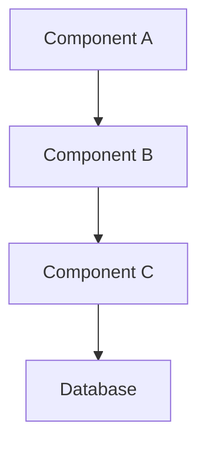
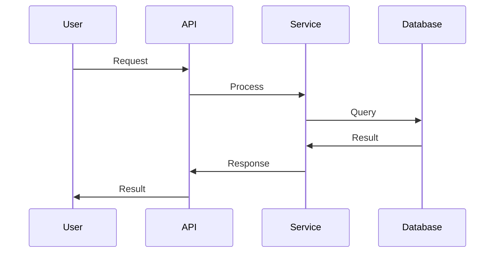

# Code and Architecture Explanation

Provide comprehensive explanation for: $ARGUMENTS

## Purpose
Break down complex code, architecture patterns, and system designs into understandable explanations with clear diagrams, examples, and context.

## Explanation Scope

### 1. Code Structure
- **Function/Method Logic**: Step-by-step breakdown of code execution
- **Class Hierarchies**: Object-oriented design and inheritance patterns
- **Module Organization**: How components interact and depend on each other
- **Data Flow**: How data moves through the system

### 2. Architecture Patterns
- **Design Patterns**: MVC, Observer, Factory, Singleton, etc.
- **Architectural Styles**: Microservices, Monolithic, Layered, Event-driven
- **System Components**: Services, databases, queues, caches
- **Communication Patterns**: API design, messaging, data synchronization

### 3. Algorithm and Logic
- **Algorithm Explanation**: How algorithms work step-by-step
- **Complexity Analysis**: Time and space complexity breakdown
- **Edge Cases**: Special conditions and handling
- **Optimization Opportunities**: How the logic could be improved

### 4. System Design
- **High-level Overview**: System architecture and component interaction
- **Data Models**: Database schemas, entity relationships
- **API Design**: Endpoints, request/response patterns
- **Security Considerations**: Authentication, authorization, data protection

## Analysis Process

### Step 1: Context Discovery
```bash
# Understand the scope and purpose
# - Identify the main objective
# - Determine the audience level (beginner/intermediate/advanced)
# - Establish the explanation depth needed
```

### Step 2: Structure Analysis
```bash
# Break down the components
# - Map out the main components
# - Identify relationships and dependencies
# - Trace execution paths and data flow
```

### Step 3: Pattern Recognition
```bash
# Identify design patterns and conventions
# - Recognize common patterns used
# - Understand architectural decisions
# - Note any anti-patterns or technical debt
```

### Step 4: Explanation Generation
```bash
# Create structured explanation
# - Start with high-level overview
# - Drill down into specifics
# - Provide examples and analogies
# - Include visual representations where helpful
```

## Output Format

```markdown
## 📚 Code/Architecture Explanation

### 🔍 Overview
[High-level summary of what this code/system does]

### 🏗️ Architecture Summary
- **Type**: [Monolithic/Microservices/Layered/etc.]
- **Main Components**: [List key components]
- **Primary Patterns**: [Design patterns used]
- **Technology Stack**: [Languages, frameworks, tools]

### 📊 Component Breakdown

#### Component 1: [Name]
- **Purpose**: [What it does]
- **Responsibilities**: [Key functions]
- **Dependencies**: [What it depends on]
- **Interactions**: [How it communicates with other components]



#### Component 2: [Name]
[Similar breakdown]

### 🔄 Data Flow
1. **Input**: [Where data enters the system]
2. **Processing**: [How data is transformed]
3. **Storage**: [How/where data is persisted]
4. **Output**: [How results are returned]



### 🧠 Key Algorithms/Logic

#### Algorithm: [Name]
**Purpose**: [What problem it solves]

**Step-by-step**:
1. [First step with explanation]
2. [Second step with explanation]
3. [Third step with explanation]

**Complexity**: 
- Time: O(n)
- Space: O(1)

**Example**:
```python
# Concrete example with comments
def example_algorithm(input_data):
    # Step 1: Initialize variables
    result = []
    
    # Step 2: Process each item
    for item in input_data:
        processed_item = transform(item)
        result.append(processed_item)
    
    return result
```

### 🎯 Design Decisions

#### Decision 1: [Choice Made]
- **Reasoning**: [Why this approach was chosen]
- **Trade-offs**: [What was gained/lost]
- **Alternatives**: [Other options considered]

#### Decision 2: [Another Choice]
- **Context**: [Situation that led to this decision]
- **Benefits**: [Advantages of this approach]
- **Limitations**: [Known drawbacks]

### 🔗 Dependencies and Integration
- **External APIs**: [Third-party services used]
- **Libraries/Frameworks**: [Key dependencies]
- **Infrastructure**: [Deployment and runtime requirements]

### 🛡️ Security and Error Handling
- **Authentication**: [How users are authenticated]
- **Authorization**: [How permissions are enforced]  
- **Error Handling**: [How errors are caught and handled]
- **Logging**: [What is logged and where]

### 💡 Key Takeaways
1. [Most important insight about the system]
2. [Critical pattern or concept to understand]
3. [Potential areas for improvement]

### 📖 Further Reading
- [Related documentation]
- [Useful resources for deeper understanding]
```

## Explanation Strategies

### For Different Audiences
- **Beginners**: Start with analogies, provide more context, explain terminology
- **Intermediate**: Focus on patterns, design decisions, best practices
- **Advanced**: Emphasize trade-offs, performance implications, scalability concerns

### Visual Aids
- **Diagrams**: Use Mermaid for architecture, sequence, and flow diagrams
- **Code Examples**: Provide concrete, commented examples
- **Analogies**: Use real-world comparisons for complex concepts

## Usage Examples

```bash
# Explain specific code file
/explain "src/authentication/auth-service.js"

# Explain system architecture  
/explain "microservices architecture in user management system"

# Explain algorithm
/explain "quicksort implementation in utils/sorting.py"

# Explain design pattern usage
/explain "observer pattern implementation in notification system"

# Explain database design
/explain "user and permissions table relationships"

# Explain API design
/explain "REST API endpoints in /api/v1/users"
```

## Integration with Development Workflow

### Documentation Generation
- Create technical documentation from explanations
- Generate README sections for complex modules
- Build architectural decision records (ADRs)

### Onboarding Support
- Help new team members understand codebase
- Provide context for legacy code sections
- Explain complex business logic

### Code Review Enhancement
- Supplement code reviews with explanations
- Document reasoning behind complex implementations
- Share knowledge across the team

Execute comprehensive explanation for: $ARGUMENTS